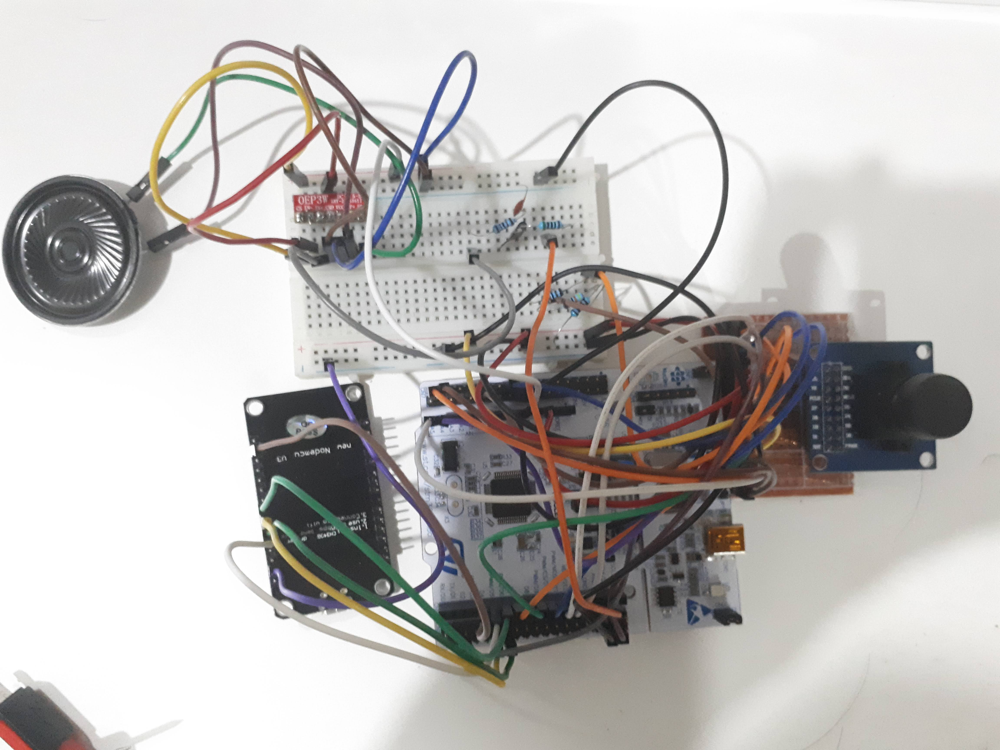

# Hardware Overview

## Introduction

**COVID-19 pandemic** requires human to avoid contact with other human and maintain social-distancing including gathering of the crowd. To encourage social-distancing guideline, we developed a tool for
monitoring the crowd density in the premises.

**Crowd Desity Monitor Project Team** developed a system to monitor density of the crowd in premises using an IoT-enabled camera with speaker ("The hardware"), The computer-vision footage analysis and storage ("The infras") and an online web-app to view the footage and changes of the crowd's density ("The webapp").

This section describe **the hardware** part of this system. The hardware
is a device with a camera capable of delivering periodic footage of the premises to *the infras* using WiFi Internet.  The hardware also contained a speaker for public-announcement when the crowd's density is too high.

This section contains the hardware's

- Design Requirement
- Functional description
- Technical Implementation

Additionally, This document may be useful if you're developing

- Low-cost image capturing using OV7670 camera module on entry-tier microcontroller (STM32F401RE)
- Custom HTTPClient for sending relatively large-image (bigger than available memory) through ESP8266
- Low-cost speaker using microcontroller's PWM

# Design Requirement

Given the objective of the project. The controller should conform to following requirements

## Recognize the crowd

The device must be capable of capturing the crowd at a resolution where crowd-density may be recognized. The device must capture the crowd-periodically over the day.

## Very Low-cost

Monitoring the crowd requires many camera angles. 
The device's peripheral must be inexpensive to allow for large-number of deployment.

## Able to warn the crowd

The device must be able to warn the crowd of over-density situation.

Given the design requirements above. We designed the device's functional components accordingly.

# Device Description

## Functional Description

The hardware is capable of

- Capturing QCIF(174 x 144) photo
- Sending the photo over WiFi via HTTP protocol
- Playing the pre-programmed audio in response to HTTP Response
- Real-time continuous capture @ 0.02 FPS (56 seconds per Frame)

## Components

It is accomplished using

- STM32F401RE Microcontroller
- OV7670 Camera module
- ESP8266 WiFi Module
- OEP3W Audio amplifier and a speaker
- Breadboard for connecting components and a custom-made Perfboard for connecting the camera

## Cost

| Peripheral | Cost (THB) |
| -----------|------|
| ESP8266 WiFi | 95 |
| OV7670 Camera | 80 |
| OEP3W | 28 |
| **Total** | 203 |

The interconnection, passive component, and the cost of Nucleo-F401RE is not included.

This design is significantly cheaper than 360THB of ESP32-CAM. (*note* that this comparison may not be fair on some situation since one can use ESP32-CAM to replace the Nucleo-F401RE)

# Implementation

## OV7670 Camera

OV7670 Camera module is describe by these two publicly-available document

- OV7670 Chip Datasheet
- OV7670 Implementation Guide

Additionally some people have also worked on implementing it on low-powered device eg. Arduino, STM32F4 (with DCIM)

- [Embedded Programmer](https://web.archive.org/web/20210528072941/http://embeddedprogrammer.blogspot.com/2012/07/hacking-ov7670-camera-module-sccb-cheat.html)
- [Mr.Arduino on Arduino Forum](https://web.archive.org/web/20210602162156/https://forum.arduino.cc/t/using-ov7670-camera-module-in-uno-or-mega/242178)

STM32F401RE is an entry-level microcontroller so it has 
- Slow speed
- No dedicated DCIM hardware
- Limited memory

OV7670 Camera, however, requires high-speed (10s of MHz) I/O to properly capture the image.

Despite the challenge, We managed to succesfully capture the image using STM32. We shall now describe our method and consideration

### More reliable connection with Perfboard wiring

Camera signal is very sensitive to noise, Missing a data-point could caused cascading failure of the image content. We hand-soldered the Breakout Perfboard using 18 x 100micron-diameter wires to give the pin more space for the jumper cable connector to work reliably and not get push out-of-position by other jumper connector.

### Underclocking and PLL

We clocked the OV7670 at the lowest possible datasheet limit (10MHz). CLocking below that may resulted in unstability. Since the clock signal need to passthrough the breadboard track to the voltage divider which introduce noises. We enabled PLL clock on the OV7670 chip to make the clean clock signal and good quality image.

Additionally, We also set the chip's internal clock divider to obtain the lowest clock speed.

### Lowest resolution

Since VGA image won't fit on our STM32's memory. We use preset QCIF format which only take 50KB.

### Proper configuration

The OV7670 chip use SCCB to program the chip. It is very similar to I2C and, in fact, we can use STM32 I2C library to write to the chip's register. Reading register require one to disable I2C ACK signal.

Additionally, Aside from documented register, There're also reserved registes **MUST be configured** with a proper value. This OEM value may be obtained from Linux's OV7670 Driver Code.

### Fast-GPIO Read using DMA

STM32's DMA can be used to quickly read the GPIO's IDR register to the memory. We setup a clck capturing PCLK signal, which then trigger the DMA transfer.

DMA should be in circular mode to continuously capture the data. TIM control should be use to start/stop the DMA as it has lower overhead.

PCLK should be latched by HREF

### TIM IC for synchronization

We use TIM's input capture in interupt mode to store frame's VSYNC and HSYNC signal to prevent cascading pixel error. The synchronization clock should be clocked (slave) by PCLK synchronizer timer

### Wire noise handling

The signal is very sensitive to noise, especially for breadboard circuit. We must handle these errors

- SCCB Error (Retry)
- Pixel Error (RE sync the image with SYNC signal or discard the frame since it took < 1s to capture a new one)

## ESP8266 Image transmission

### SPI

We use SPI connection with additional handshake pin to feedback the WIFi data rate to the main controller. SInce the connection is very noisy being a jumper wire. We attached positional signal to the data with additional error-detection byte to keep the image data in sync (but may result in some lost pixel)

Some care must be taked because ESP8266 SPISlave have a very specific protocol (`HSPI`). We build another command and data transmission protocol on top of that.

### Custom HTTP Streaming

Because ESP8266 have even less momory than STM32's. We must transmit the data over the internet as a stream. We custom build a HTTP transmission code  on top of the low-level TCP layer of `WiFiClient`. This code is also capable of providing HTTP Response feedback through `HSPI`'s Status register command.

## Audio

We just feed the PCM data using timing clock interupt into another timer's PWM pulse which has very high frequency PWM, We then pass it through RC filter and passed it to Audio Amplifier. This method has many downside but it's cheap and it work.

## C-implementation

C-implementation of this project can be found in our github repo.
